# 🍽️ ScanFeast (Under Construction)

**AI-Powered Food Scanning & Nutrition Intelligence Platform**

[](https://nextjs.org/)
[](https://reactnative.dev/)
[](https://expo.dev/)
[](https://ui.shadcn.com/)
[](https://www.typescriptlang.org/)
[](https://tailwindcss.com/)
[](https://ai.com)

> **Revolutionary cross-platform application that instantly identifies food, analyzes nutrition, and provides personalized dietary insights through advanced computer vision and AI.**

---

## 🌟 Project Overview

ScanFeast transforms how people interact with food through cutting-edge AI technology. Simply point your camera at any dish or ingredient, and our sophisticated machine learning models instantly provide comprehensive nutritional analysis, dietary insights, and personalized recommendations - all wrapped in a beautiful, intuitive interface across web and mobile platforms.

```mermaid
graph TD
    A[📱 Camera Capture] --> B[🤖 AI Food Recognition]
    B --> C[🔍 Nutrition Analysis]
    C --> D[📊 Health Insights]
    D --> E[💡 Personalized Recommendations]
    E --> F[📈 Progress Tracking]
    F --> G[🎯 Goal Achievement]
    
    H[🌐 Web Platform] --> A
    I[📱 Mobile App] --> A
    
    style A fill:#ff6b6b
    style B fill:#4ecdc4
    style C fill:#45b7d1
    style D fill:#96ceb4
    style E fill:#ffeaa7
    style F fill:#dda0dd
    style G fill:#ff9ff3
    style H fill:#54a0ff
    style I fill:#5f27cd
```

<div align="center">



</div>

## ✨ Core Features

### 🤖 **Advanced AI Food Recognition**
- **Instant Food Identification**: State-of-the-art computer vision models with 95%+ accuracy
- **Multi-Food Detection**: Simultaneously identify multiple items in complex dishes
- **Ingredient Breakdown**: AI-powered ingredient analysis and portion estimation
- **Real-Time Processing**: Lightning-fast recognition in under 2 seconds

### 📊 **Comprehensive Nutrition Analysis**
- **Macro & Micronutrient Breakdown**: Complete nutritional profile with vitamins and minerals
- **Calorie Counting**: Accurate calorie estimation with portion size detection
- **Allergen Detection**: Automatic identification of common allergens and dietary restrictions
- **Nutritional Scoring**: Health rating system with improvement suggestions

### 📱 **Cross-Platform Excellence**
- **Progressive Web App**: Seamless web experience with offline capabilities
- **Native Mobile Apps**: iOS and Android apps with native performance
- **Synchronized Data**: Real-time sync across all devices and platforms
- **Responsive Design**: Pixel-perfect UI adaptation for all screen sizes

### 🎯 **Personalized Health Insights**
- **Custom Dietary Goals**: Personalized nutrition targets based on user profiles
- **Health Tracking**: Comprehensive progress monitoring and analytics
- **Smart Recommendations**: AI-driven meal suggestions and alternatives
- **Integration Ready**: Connect with fitness trackers and health platforms

## 🛠️ Technology Stack

### **Frontend Frameworks**
- **Next.js 14+** - Full-stack React framework with App Router and server components
- **React Native Expo** - Cross-platform mobile development with native performance
- **TypeScript** - Type-safe development with enhanced developer experience

### **UI & Design Systems**
- **shadcn/ui** - Modern, accessible React component library
- **Tailwind CSS** - Utility-first CSS framework for rapid styling
- **Radix UI** - Headless UI primitives for complex interactions
- **React Native Elements** - Consistent mobile UI components

### **Data & State Management**
- **React Query/TanStack Query** - Server state management and caching
- **Zustand** - Lightweight state management for complex app states
- **AsyncStorage** - Persistent storage for mobile offline capabilities
- **IndexedDB** - Client-side database for web offline functionality

### **Development Tools**
- **Expo CLI** - Streamlined mobile development and deployment
- **ESLint & Prettier** - Code quality and formatting standards
- **Husky** - Git hooks for automated testing and validation
- **Metro Bundler** - React Native bundling and optimization

## 🚀 Quick Start

### Prerequisites

```bash
# Install Node.js 18+
node --version

# Install Expo CLI globally
npm install -g @expo/cli

# Verify installations
expo --version
```

### 📱 Mobile Development Setup

```bash
# Clone the repository
git clone https://github.com/yourusername/scanfeast.git
cd scanfeast

# Install mobile dependencies
cd android-ios
npm install

# Start Expo development server
expo start

# Run on iOS simulator
expo run:ios

# Run on Android emulator
expo run:android
```

### 🌐 Web Development Setup

```bash
# Navigate to web directory

# Install web dependencies
npm install

# Start Next.js development server
npm run dev

# Build for production
npm run build
```

## 📱 Mobile Features

### **Camera Integration**
```typescript
// mobile/src/components/CameraScanner.tsx
import { Camera } from 'expo-camera';
import { useState, useRef } from 'react';

export const CameraScanner = () => {
  const [hasPermission, setHasPermission] = useState<boolean | null>(null);
  const cameraRef = useRef<Camera>(null);
  
  const takePicture = async () => {
    if (cameraRef.current) {
      const photo = await cameraRef.current.takePictureAsync({
        quality: 0.8,
        base64: true,
        skipProcessing: false
      });
      
      // Process with AI
      await processFoodImage(photo.uri);
    }
  };
  
  return (
    <Camera
      ref={cameraRef}
      style={{ flex: 1 }}
      type={Camera.Constants.Type.back}
      ratio="16:9"
    >
      {/* Camera UI */}
    </Camera>
  );
};
```

## 🌐 Web Features

## 🧪 Testing Strategy

### **Unit Testing**
```bash
# Run web tests
cd web && npm run test

# Run mobile tests
cd mobile && npm run test

# Run with coverage
npm run test:coverage
```


## 📦 Deployment

### **Mobile App Deployment**
```bash
# Build for production
cd mobile && expo build:android
cd mobile && expo build:ios

# Submit to app stores
expo submit --platform android
expo submit --platform ios
```

### **Web Deployment**
```bash
# Build and deploy web app
cd web && npm run build
vercel --prod

# Environment variables
vercel env add AI_API_KEY
vercel env add DATABASE_URL
```

## 🎓 Learning Outcomes

### **Cross-Platform Mastery**
**Unified Development**: Mastered building cohesive experiences across web and mobile platforms while maintaining shared business logic and consistent user experiences through strategic code sharing and architectural patterns.

### **AI Integration Expertise**
**Computer Vision Implementation**: Developed deep understanding of integrating machine learning models into production applications, including real-time image processing, model optimization, and edge computing for mobile devices.

### **Modern React Patterns**
**Advanced State Management**: Implemented sophisticated state management solutions using React Query for server state and Zustand for client state, enabling seamless offline-first experiences with conflict resolution.

### **Performance Optimization**
**Mobile Performance**: Optimized React Native applications for 60fps performance through efficient rendering patterns, image optimization, native module integration, and memory management techniques.

### **UI/UX Design Systems**
**Component Architecture**: Built scalable design systems using shadcn/ui and Tailwind CSS, creating reusable components that work seamlessly across web and mobile platforms with consistent styling and behavior.

## 🔮 Future Roadmap

### 🤖 **Enhanced AI Capabilities**
- **Recipe Recognition**: Identify complete recipes from dish photos
- **Cooking Instructions**: AI-generated cooking steps and techniques
- **Meal Planning**: Intelligent weekly meal planning with shopping lists
- **Dietary Coaching**: Personalized nutrition coaching with AI recommendations

### 🌟 **Advanced Features**
- **Social Sharing**: Share meals and compete with friends
- **Restaurant Integration**: Partner with restaurants for menu scanning
- **Wearable Integration**: Apple Watch and smartwatch compatibility
- **Voice Commands**: Hands-free food logging with voice recognition

### 📊 **Analytics & Insights**
- **Health Trends**: Long-term health pattern analysis
- **Predictive Analytics**: Predict nutrition needs based on activity
- **Integration APIs**: Connect with fitness and health platforms
- **Professional Tools**: Features for nutritionists and dietitians

## 🤝 Contributing

We welcome contributions from the community!

```bash
# Fork and clone
git clone https://github.com/yourusername/scanfeast.git

# Install dependencies
npm run install:all

# Create feature branch
git checkout -b feature/meal-planning

# Run tests
npm run test:all

# Submit PR
git push origin feature/meal-planning
```

## 📄 License

This project is licensed under the MIT License - see [LICENSE](LICENSE) for details.

## 🙏 Acknowledgments

- **Expo Team** for the incredible cross-platform development tools
- **Vercel** for seamless Next.js hosting and deployment
- **shadcn** for the beautiful and accessible UI components
- **Open Source Community** for the amazing ecosystem of tools

## 📞 Support

- 📧 Email: adityagupta2087@gmail.com
- 🐛 Issues: [GitHub Issues](https://github.com/yourusername/scanfeast-web/issues)

---

<div align="center">

**🍽️ Revolutionizing Food Intelligence with AI 🤖**
• [🌐 Try Web App](https://scan-feast.vercel.app)

</div>
